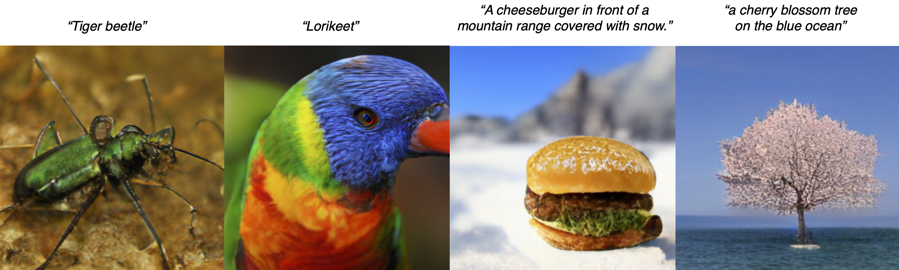
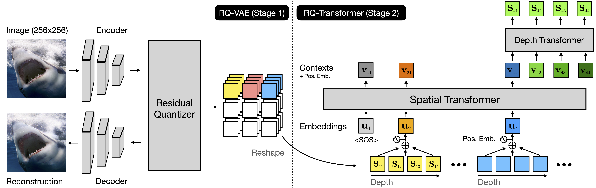

# Autoregressive Image Generation using Residual Quantization (CVPR 2022)
The official implementation of ["Autoregressive Image Generation using Residual Quantization"](https://arxiv.org/abs/2203.01941)  
Doyup Lee*, Chiheon Kim*, Saehoon Kim, Minsu Cho, Wook-Shin Han (\* Equal contribution)  
**CVPR 2022**

<center></center>

The examples of generated images by RQ-Transformer using class conditions and text conditions.   
Note that the text conditions of the examples are not used in training time.    

**TL;DR** For autoregressive (AR) modeling of high-resolution images, we propose the two-stage framework, which consists of RQ-VAE and RQ-Transformer. Our framework can precisely approximate a feature map of an image and represent an image as a stack of discrete codes to effectively generate high-quality images.

<center></center>  


## Requirements
We have tested our codes on the environment below  
- `Python 3.7.10` / `Pytorch 1.9.0` / `torchvision 0.10.0` / `CUDA 11.1` / `Ubuntu 18.04`  .  

Please run the following command to install the necessary dependencies
```bash
pip install -r requirements.txt
```

## Coverage of Released Codes
- Implementation of RQ-VAE and RQ-Transformer
- Pretrained checkpoints of RQ-VAEs and RQ-Transformers
- Training and evaluation pipelines of RQ-VAE  
- Image generation and its evaluation pipeline of RQ-Transformer
- Jupyter notebook for text-to-image generation of RQ-Transformer 

## Pretrained Checkpoints
### Checkpoints Used in the Original Paper
We provide pretrained checkpoints of RQ-VAEs and RQ-Transformers to reproduce the results in the paper. Please use the links below to download `tar.gz` files and unzip the pretrained checkpoints.  Each link contains pretrained checkpoints of RQ-VAE and RQ-Transformer and their model configurations.  

| Dataset        | RQ-VAE & RQ-Transformer | # params of RQ-Transformer |      FID     |
|----------------|:-----------------------:|:--------:|:------------:|
| FFHQ           |           [link](https://twg.kakaocdn.net/brainrepo/models/RQVAE/d47570aeff6ba300735606a806f54663/ffhq.tar.gz)          |   355M   |     10.38    |
| LSUN-Church    |           [link](https://twg.kakaocdn.net/brainrepo/models/RQVAE/deeb3e0ac6e09923754e3e594ede7b01/church.tar.gz)          |   370M   |     7.45     |
| LSUN-Cat       |           [link](https://twg.kakaocdn.net/brainrepo/models/RQVAE/92b4e6a9ace09c9ab8ff9d3b3e688367/cat.tar.gz)          |   612M   |     8.64     |
| LSUN-Bedroom   |           [link](https://twg.kakaocdn.net/brainrepo/models/RQVAE/06b72c164cd2fe64fc8ebd6b42b0040f/bedroom.tar.gz)          |   612M   |     3.04     |
| ImageNet (cIN) |           [link](https://twg.kakaocdn.net/brainrepo/models/RQVAE/7518a004fe39120fcffbba76005dc6c3/imagenet_480M.tar.gz)          |   480M   |     15.72    |
| ImageNet (cIN) |           [link](https://twg.kakaocdn.net/brainrepo/models/RQVAE/dcd39292319104da5577dec3956bfdcc/imagenet_821M.tar.gz)          |   821M   |     13.11    |
| ImageNet (cIN) |           [link](https://twg.kakaocdn.net/brainrepo/models/RQVAE/f5cf4e5f3f0b5088d52cbb5e85c1077f/imagenet_1.4B.tar.gz)          |   1.4B   | 11.56 (4.45) |
| ImageNet (cIN) |           [link](https://twg.kakaocdn.net/brainrepo/models/RQVAE/6714b47bb9382076923590eff08b1ee5/imagenet_1.4B_rqvae_50e.tar.gz)          |   1.4B   |  8.71 (3.89) |
| ImageNet (cIN) |           [link](https://twg.kakaocdn.net/brainrepo/models/RQVAE/e1ee2fef2928f7fd31f53a8348f08b88/imagenet_3.8B_rqvae_50e.tar.gz)          |   3.8B   |  7.55 (3.80) |
| CC-3M          |           [link](https://twg.kakaocdn.net/brainrepo/models/RQVAE/dcd95e8f08408e113aab6451fae895f5/cc3m.tar.gz)          |   654M   |     12.33    |

FID scores above are measured based on original samples and generated images, and the scores in brackets are measured using 5% rejection sampling via pretrained ResNet-101. We do not provide the pipeline of rejection sampling in this repository.  


### **(NOTE)** Large-Scale RQ-Transformer for Text-to-Image Generation 

We also provide the pretrained checkpoint of **large-scale** RQ-Transformer for text-to-image (T2I) generation. Our paper does not include the results of this large-scale RQ-Transformer for T2I generation, since we trained **RQ-Transformer with 3.9B parameters** on about **30 millions of text-to-image pairs** from [CC-3M](https://github.com/google-research-datasets/conceptual-captions), [CC-12M](https://github.com/google-research-datasets/conceptual-12m), and [YFCC-subset](https://github.com/openai/CLIP/blob/main/data/yfcc100m.md) after the paper submission. Please use the link below to download the checkpoints of large-scale T2I model. We emphasize that **any commercial use of our checkpoints is strictly prohibited**.

#### Download of Pretrained RQ-Transformer on 30M text-image pairs

|           Dataset.           | RQ-VAE & RQ-Transformer | # params |
|------------------------------|:-----------------------:|:--------:|
| CC-3M + CC-12M + YFCC-subset |           [link](https://twg.kakaocdn.net/brainrepo/models/RQVAE/3a8429cd7ec0e0f2b66fca94804c79d5/cc3m_cc12m_yfcc.tar.gz)          |   3.9B   |

#### Evaluation of Large-Scale RQ-Transformer on MS-COCO
In this repository, we evaluate the pretrained RQ-Transformer with 3.9B parameters on MS-COCO.  According to the evaluation protocol of [DALL-Eval](https://arxiv.org/abs/2202.04053), we randomly select 30K text captions in `val2014` split of MS-COCO and generate 256x256 images using the selected captions. We use (1024, 0.95) for top-(k, p) sampling, and FID scores of other models are from Table 2 in [DALL-Eval](https://arxiv.org/abs/2202.04053) paper. 


| Model                 | # params | # data | Image / Grid Size |       FID on 2014val         |
|-----------------------|:--------:|:------:|:-----------------:|:----------------------------:|
| X-LXMERT              |   228M   |  180K  |   256x256 / 8x8   |          37.4                |
| DALL-E small          |   120M   |   15M  |  256x256 / 16x16  |          45.8                |
| ruDALL-E-XL           |   1.3B   |  120M  |  256x256 / 32x32  |          18.6                |
| minDALL-E             |   1.3B   |   15M  |  256x256 / 16x16  |          24.6                |
| RQ-Transformer (ours) |   3.9B   |   30M  |  256x256 / 8x8x4  |          16.9                |

Note that some text captions in MS-COCO are also included in the YFCC-subset, but the FIDs are not much different whether the duplicated captions are removed in the evaluation or not. See [this paper](https://arxiv.org/abs/2102.12092) for more details.

#### Examples of Text-to-Image (T2I) Generation using RQ-Transformer
We provide a jupyter notebook for you to easily enjoy text-to-image (T2I) generation of pretrained RQ-Transformers and the results !  After you download the pretrained checkpoints for T2I generation, open `notebooks/T2I_sampling.ipynb` and follows the instructions in the notebook file. We recommend to use a GPU such as NVIDIA V100 or A100, which has enough memory size over 32GB, considering the model size.  

We attach some examples of T2I generation from the provided Jupyter notebook.  

**Examples of Generated Images from Text Conditions**
<details>
<summary> a painting by Vincent Van Gogh </summary>
<center></center>
</details>

<details>
<summary> a painting by RENÉ MAGRITTE </summary>
<center></center>
</details>

<details>
<summary> Eiffel tower on a desert. </summary>
<center></center>
</details>

<details>
<summary> Eiffel tower on a mountain. </summary>
<center></center>
</details>

<details>
<summary> a painting of a cat with sunglasses in the frame. </summary>
<center></center>
</details>

<details>
<summary> a painting of a dog with sunglasses in the frame. </summary>
<center></center>
</details>


## Training and Evaluation of RQ-VAE

### Training of RQ-VAEs
Our implementation uses `DistributedDataParallel` in `Pytorch` for efficient training with multi-node and multi-GPU environments.  **Four NVIDIA A100 GPUs** are used to train all RQ-VAEs in our paper. You can also adjust `-nr`, `-np`, and `-nr` according to your GPU setting.  

- Training 8x8x4 RQ-VAE on ImageNet 256x256 with a single node having four GPUs
    ```bash
    python -m torch.distributed.launch \
        --master_addr=$MASTER_ADDR \
        --master_port=$PORT \
        --nnodes=1 --nproc_per_node=4 --node_rank=0 \ 
        main_stage1.py \
        -m=configs/imagenet256/stage1/in256-rqvae-8x8x4.yaml -r=$SAVE_DIR
    ```

- If you want to train 8x8x4 RQ-VAE on ImageNet using four nodes, where each node has one GPU, run the following scripts at each node with `$RANK` being the node rank (0, 1, 2, 3). Here, we assume that the master node corresponds to the node with rank 0.  
    ```bash
    python -m torch.distributed.launch \
        --master_addr=$MASTER_ADDR \
        --master_port=$PORT \
        --nnodes=4 --nproc_per_node=1 --node_rank=$RANK \ 
        main_stage1.py \
        -m=configs/imagenet256/stage1/in256-rqvae-8x8x4.yaml -r=$SAVE_DIR
    ```


### Finetuning of Pretrained RQ-VAE
- To finetune a pretrained RQ-VAE on other datasets such as LSUNs, you have to load the pretrained checkpoints giving `-l=$RQVAE_CKPT` argument.
- For example, when a pretrained RQ-VAE is finetuned on LSUN-Church, you can run the command below:
    ```bash
    python -m torch.distributed.launch \
        --master_addr=$MASTER_ADDR \
        --master_port=$PORT \
        --nnodes=1 --nproc_per_node=4 --node_rank=0 \ 
        main_stage1.py \
        -m=configs/lsun-church/stage1/church256-rqvae-8x8x4.yaml -r=$SAVE_DIR -l=$RQVAE_CKPT 
    ```


### Evaluation of RQ-VAEs
Run `compute_rfid.py` to evaluate the reconstruction FID (rFID) of learned RQ-VAEs. 

```bash
python compute_rfid.py --split=val --vqvae=$RQVAE_CKPT
```

- The model checkpoint of RQ-VAE and its configuration yaml file have to be located in the same directory.
- `compute_rfid.py` evaluates rFID of RQ-VAE on the dataset in the configuration file.
- Adjust `--batch-size` as the memory size of your GPU environment.


## Evaluation of RQ-Transformer
In this repository, the quantitative results in the paper can be reproduced by the codes for the evaluation of RQ-Transformer. Before the evaluation of RQ-Transformer on a dataset, the dataset has to be prepared for computing the feature vectors of its samples. To reproduce the results in the paper, we provide the statistics of feature vectors of each dataset, since extracting feature vectors accompanies computational costs and a long time. You can also prepare the datasets, which are used in our paper, as you follow the instructions of `data/READMD.md`.   

- Download the feature statistics of datasets as follows:
    ```bash
    cd assets
    wget https://twg.kakaocdn.net/brainrepo/etc/RQVAE/8b325b628f49bf60a3094fcf9419398c/fid_stats.tar.gz
    tar -zxvf fid_stats.tar.gz
    ```

#### FFHQ, LSUN-{Church, Bedroom, Cat}, (conditional) ImageNet
- After the pretrained RQ-Transformer generates 50K images, FID (and IS) between the generated images and its training samples is computed.  
- You can input `--save-dir` to specify directory where the generated images are saved. If `--save-dir` is not given, the generated images are saved at the directory of the checkpoint.  
- When four GPUs in a single node are used, run the command below
    ```bash
    python -m torch.distributed.launch \
      --master_addr=$MASTER_ADDR \
      --master_port=$PORT \
      --nnodes=1 --nproc_per_node=4 --node_rank=0 \ 
      main_sampling_fid.py \
      -v=$RQVAE_CKPT -a=$RQTRANSFORMER_CKPT --save-dir=$SAVE_IMG_DIR
    ```

#### CC-3M
- After the pretrained RQ-Transformer generates images using text captions of CC-3M validation set, FID between the validation images and generated images is computed together with CLIP score of generated images and their text conditions.
- Evaluation of RQ-Transformer requires text prompts of cc-3m. Thus, please refer to [`data/READMD.md`](data/READMD.md) and prepare the dataset first.  
- When four GPUs in a single node are used, run the command below
    ```bash
    python -m torch.distributed.launch \
      --master_addr=$MASTER_ADDR \
      --master_port=$PORT \
      --nnodes=1 --nproc_per_node=4 --node_rank=0 \ 
      main_sampling_txt2img.py \
      -v=$RQVAE_CKPT -a=$RQTRANSFORMER_CKPT --dataset="cc3m" --save-dir=$SAVE_IMG_DIR
    ```

#### MS-COCO
- We follow the protopocal of DALL-Eval to evaluate RQ-Transformer on MS-COCO, we use 30K samples, which are randomly selected in MS-COCO `2014val` split, and provide the sampled samples as `json` file.
- Evaluation of RQ-Transformer requires text prompts of MS_COCO. Thus, please refer to [`data/READMD.md`](data/README.md) and prepare the dataset first.  
- When four GPUs in a single node are used, run the command below
    ```bash
    python -m torch.distributed.launch \
      --master_addr=$MASTER_ADDR \
      --master_port=$PORT \
      --nnodes=1 --nproc_per_node=4 --node_rank=0 \ 
      main_sampling_txt2img.py \
      -v=$RQVAE_CKPT -a=$RQTRANSFORMER_CKPT --dataset="coco_2014val" --save-dir=$SAVE_IMG_DIR
    ```

**NOTE**
- Unfortunately, we do not provide the training code of RQ-Transformer to avoid unexpected misuses by finetuning our checkpoints. We note that **any commercial use of our checkpoints is strictly prohibited**.
- To accurately reproduce the reported results, **the checkpoints of RQ-VAE and RQ-Transformer are correctly matched** as described above.
- The generated images are saved as `.pkl` files in the directory `$DIR_SAVED_IMG`.
- For top-k and top-p sampling, the saved setting in the configuration file of pretrained checkpoints is used. If you want to use different top-(k,p) settings, use `--top-k` and `--top-p` in running the sampling scripts.  
- Once generated images are saved, `compute_metrics.py` can be used to evaluate the images again as follows:
```bash
python compute_metrics.py fake_path=$DIR_SAVED_IMG ref_dataset=$DATASET_NAME
```

### Sampling speed benchmark
We provide the codes to measure the sampling speed of RQ-Transformer according to the code shape of RQ-VAEs, such as 8x8x4 or 16x16x1, as shown in [Figure 4](assets/figures/sampling_speed_comparison.png) in the paper. To reproduce the figure, run the following commands on NVIDIA A100 GPU:  
```bash
# RQ-Transformer (1.4B) on 16x16x1 RQ-VAE (corresponds to VQ-GAN 1.4B model)
python -m measure_throughput f=16 d=1 c=16384 model=huge batch_size=100
python -m measure_throughput f=16 d=1 c=16384 model=huge batch_size=200
python -m measure_throughput f=16 d=1 c=16384 model=huge batch_size=500  # this will result in OOM.

# RQ-Transformer (1.4B) on 8x8x4 RQ-VAE
python -m measure_throughput f=32 d=4 c=16384 model=huge batch_size=100
python -m measure_throughput f=32 d=4 c=16384 model=huge batch_size=200
python -m measure_throughput f=32 d=4 c=16384 model=huge batch_size=500
```

## BibTex
```
@inproceedings{lee2022autoregressive,
  title={Autoregressive Image Generation using Residual Quantization},
  author={Lee, Doyup and Kim, Chiheon and Kim, Saehoon and Cho, Minsu and Han, Wook-Shin},
  booktitle={Proceedings of the IEEE/CVF Conference on Computer Vision and Pattern Recognition},
  pages={11523--11532},
  year={2022}
}
```

## Licenses
- The source codes are licensed under [Apache 2.0](LICENSE.apache-2.0) License.  
- The pretrained weights are licensed under [CC-BY-NC-SA 4.0](LICENSE.cc-by-nc-sa-4.0) License.  

## Contact
If you would like to collaborate with us or provide us a feedback, please contaus us,contact@kakaobrain.com  

## Acknowledgement
Our transformer-related implementation is inspired by [minGPT](https://github.com/karpathy/minGPT) and [minDALL-E](https://github.com/kakaobrain/minDALL-E).
We appreciate the authors of [VQGAN](https://github.com/CompVis/taming-transformers) for making their codes available to public.

## Limitations
Since RQ-Transformer is trained on publicly available datasets, some generated images can include socially unacceptable contents according to the text conditions. When the problem occurs, please let us know the pair of "text condition" and "generated images".
